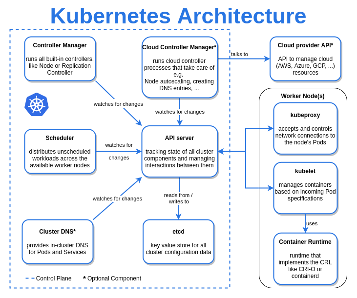
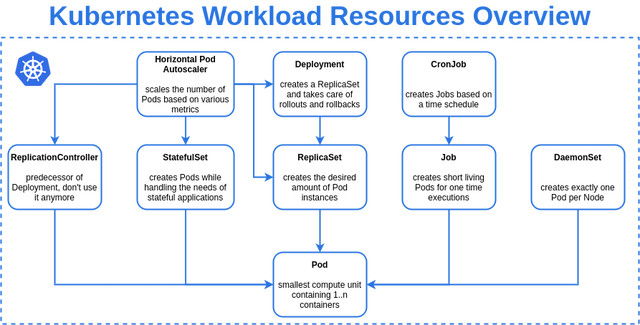

# Kubernetes Workshop part 1

## The basics from a users perspective

https://github.com/benmathews/KubernetesWorkshop

<!-- I'm going to experiment with using teams status to know when I can move on. Set to busy when working on a problem and available when ready to move on.
-->

---

# Prerequisites

## Kubernetes Cluster

To complete this workshop you need a working kubernetes cluster and registry running on your laptop. Your options include

- [Minikube](https://minikube.sigs.k8s.io/docs/) - mature, but perhaps a little heavy. Officially supported
- [MicroK8S](https://microk8s.io/) - lightweight, from Canonical
- [K3S](https://k3s.io/) - super lightweight, from Rancher
- [Docker Desktop](https://www.docker.com/products/docker-desktop) - built into Windows and Mac docker install

I strongly recommend MicroK8S (and some instructions will be MicroK8S specific). But any of these should work.

---

# Prerequisites

## Kubectl

You also need [kubectl installed](https://kubernetes.io/docs/tasks/tools/install-kubectl/).

And although not required, it is very helpful to have autocomplete configured.

```
# bash-completion package should be installed first.
source <(kubectl completion bash) 
echo "source <(kubectl completion bash)" >> ~/.bashrc 
```

---

# Prerequisites

## Configuration

Set up the the configuration that will connect kubectl to your cluster with 

```
# backup your existing config first
microk8s config > ~/.kube/config
```

Before attending the workshop, you should be able to run this command and get a response.

```
$ kubectl version
Client Version: version.Info{Major:"1", Minor:"18", ...
Server Version: version.Info{Major:"1", Minor:"17", ...
```

---

# Prerequisites

## Registration

Set up a registry 

```
microk8s enable registry
```

Add to /etc/docker/daemon.json
```
{
  "insecure-registries" : ["localhost:32000"]
}
```

```
sudo systemctl restart docker
```

---

# Prerequisites

## Other tools

- Install [stern](https://github.com/wercker/stern).

Clone this repo to get a sample app and container

``` bash
git clone git@github.com:benmathews/KubernetesWorkshop.git
```

---

# What is Kubernetes

An open-source system for automating 

* deployment, 
* scaling, 
* and management 

of containerized applications.

---



<!-- credit https://www.reddit.com/r/kubernetes/comments/k8kqdr/overview_of_kubernetes_architecture/-->

---

# Kubectl - Kubernetes CLI

Run these commands and understand the flags and output

``` bash
kubectl
kubectl version
kubectl explain
kubectl explain deployment
kubectl get nodes
kubectl describe nodes -h
kubectl describe nodes
```

---

# Namespaces

- Virtual clusters backed by the same physical cluster.
- Help different projects and teams to share a Kubernetes cluster.

Create a namespace for this workshop.

``` bash
kubectl create namespace <namespace name>
```

---

# Default Namespace

Kubectl has a `-n` parameter to specify which namespace the command refers to. If you are using a particular namespace most of the time, a default can be set.

``` bash
kubectl config set-context --current --namespace=<namespace name>
```

---

# Pod

- The smallest deployable units of computing that you can create and manage in Kubernetes.
- A group of one or more containers, with shared storage and network resources
- The shared context of a Pod is a set of Linux namespaces and cgroups

---

# Create and examine a pod

``` bash
kubectl run demopod --image=alpine -- sleep 1000000
kubectl get pod demopod
kubectl describe pod demopod
```

Shell into the pod and do "stuff".

``` bash
kubectl exec -it demopod sh
```

Experiment with the flags for `kubectl run`.

``` bash
kubectl run -h
kubectl run demopod --image=alpine --labels='firstpod=true,effort=k8sworkshop' \
--env='foo=bar' --env='foo2=bar2' --dry-run=client -o yaml -- sleep 1000000
```

---

# Sample project

Clone presentation and build sample image

``` bash
git clone git@github.com:benmathews/KubernetesWorkshop.git
cd KubernetesWorkshop/demowebapp/
docker build . -t demowebapp:v1.0.0
```

---
# Registry

Push your image into the local registry

```
docker build . -t localhost:32000/demowebapp:v1.0.0
# or
docker tag demowebapp:v1.0.0 localhost:32000/demowebapp:v1.0.0

docker push localhost:32000/demowebapp:v1.0.0
```

---


<!-- credit https://www.reddit.com/r/kubernetes/comments/k26je7/overview_of_builtin_kubernetes_workload_resources/-->

---


# ReplicaSet

Maintain a stable set of replica Pods running at any given time. As such, it is often used to guarantee the availability of a specified number of identical Pods.

---

# Deployment

Provides declarative updates for Pods and ReplicaSets.

Deployment use cases:

- Update the state of pods. New image, env variables, etc.
- Rollback to previous revision.
- Scale up or down the number of pod replicas.
- Pause and resume rollout
- Monitor rollout status
- Undo deployment change

---

# Deployment example

``` yaml
apiVersion: apps/v1
kind: Deployment
metadata:
  labels:
    app: demodeploy
  name: demodeploy
spec:
  replicas: 1
  selector:
    matchLabels:
      app: demodeploy
  strategy: {}
  template:
    metadata:
      labels:
        app: demodeploy
    spec:
      containers:
      - image: localhost:32000/test:latest
        name: test
```
---

# Deployment practice 

 - Create a deployment.
 - Examine it and the artifacts it creates

``` bash
kubectl create deployment demodeploy --image=localhost:32000/demowebapp:v1.0.0
kubectl get deployment
kubectl describe deloyment demodeploy
kubectl get deployment demodeploy -o yaml
kubectl get rs
kubectl get pods -o wide
curl <ip>:8080
```

---
# Service 

An abstract way to expose an application running on a set of Pods as a network service.

---

# Service example

``` yaml
apiVersion: v1
kind: Service
metadata:
  labels:
    app: demodeploy
  name: demodeploy
spec:
  clusterIP: 10.152.183.2
  clusterIPs:
  - 10.152.183.2
  ports:
  - port: 80
    protocol: TCP
    targetPort: 8080
  selector:
    app: demodeploy
  sessionAffinity: None
  type: ClusterIP
```

---

# Service practice 

``` bash
kubectl expose deployment demodeploy --target-port=8080 --port=80 --type=NodePort
kubectl get service demodeploy
kubectl describe service demodeploy
curl <node ip>:<allocated port> #note no 8080
```
---
# Scale Deployment

``` bash
kubectl scale deployment demodeploy --replicas=3
kubectl get pods -l app=demodeploy
curl <node ip>:<allocated port> #note served from multiple ips
```

---
# Labels and selectors

- Key/value pairs that are attached to objects
- Intended to be used to specify identifying attributes
- Do not imply semantics to the core system
- Can be used to organize and to select subsets of objects
- Creation time and subsequently added and modified at any time
- Each Key must be unique for a given object

---

``` yaml
kind: Pod
metadata:
  labels:
    app: demodeploy
    manager: kubelet
  name: demodeploy-7b594b6fd-9t585
spec:
...
```

``` yaml
kind: Service
metadata:
  labels:
    app: demodeploy
  name: demodeploy
spec:
  selector:
    app: demodeploy
```

---

# Logs

View logs with `kubectl log` or [stern](https://github.com/wercker/stern).

``` bash
kubectl logs -f <pod name>
stern -l app=demodeploy
```
---

# Kubectl edit

- Add a new label to the pod template in your deploy

``` bash
kubectl edit deploy demodeploy
```

---


---
# Assignment

- Modify the sample node program to return "Hello Universe".
- Create a new version of the docker image and push it to your local registry.
- Create a new deployment to serve the new version.
- Modify the service so that it routes traffic to both deployments

